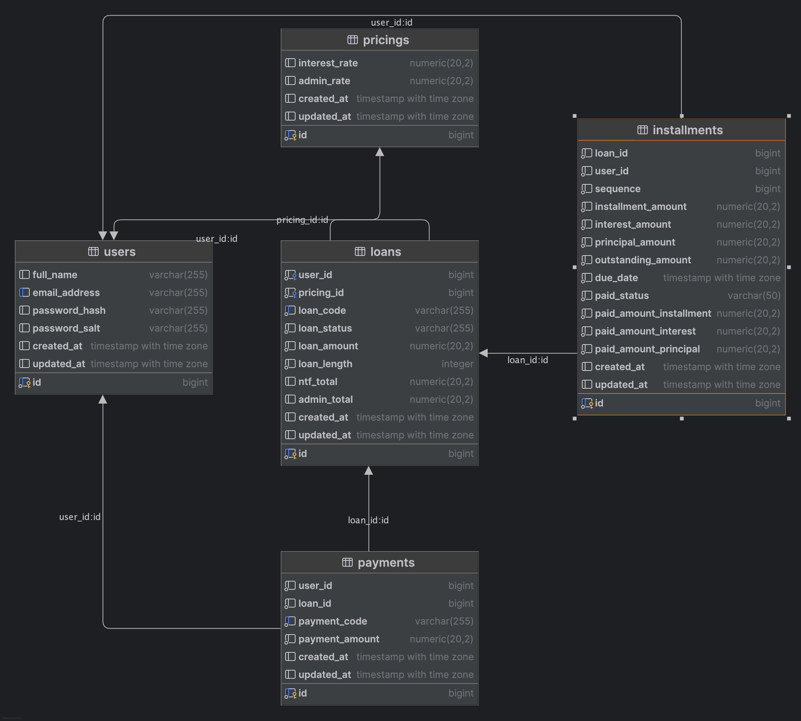

# Go Billing Engine

Go Billing Engine adalah aplikasi backend yang dibangun menggunakan Go dan GORM untuk menangani proses billing, termasuk pembuatan user, login, manajemen pinjaman, cicilan, pembayaran, dan lain-lain. Aplikasi ini menggunakan PostgreSQL sebagai database.

## Setup dan Instalasi

### Prasyarat

Pastikan kamu sudah menginstall dan menyiapkan hal-hal berikut:

1. **Go** (Minimal versi 1.18)
   - Download dan install Go dari [https://go.dev/dl/](https://go.dev/dl/)
   
2. **PostgreSQL**
   - Pastikan PostgreSQL sudah terinstall dan berjalan. Kamu bisa mengunduh PostgreSQL dari [https://www.postgresql.org/download/](https://www.postgresql.org/download/).

3. **GIT**
   - Pastikan Git sudah terinstall. Kamu bisa mengunduhnya di [https://git-scm.com/downloads](https://git-scm.com/downloads).

4. **.env file**
   - Buat file `.env` di root proyek untuk menyimpan variabel lingkungan yang dibutuhkan aplikasi. Contoh `.env` bisa dilihat di bawah ini.

### Langkah 1: Clone Proyek

Clone repositori ini ke dalam direktori lokal kamu:

```bash
git clone https://github.com/frammawiliansyah/go-billing-engine.git
```

Masuk ke dalam direktori proyek:

```bash
cd go-billing-engine
```

### Langkah 2: Install Dependencies

Install dependencies yang dibutuhkan oleh proyek dengan perintah berikut:

```bash
go mod tidy
```

### Langkah 3: Konfigurasi `.env`

Buat file `.env` di root proyek dan isi dengan konfigurasi berikut:

```
DB_HOST=localhost
DB_USER=postgres
DB_PASS=your_password
DB_NAME=go_billing
DB_PORT=5432
```

Pastikan untuk mengganti nilai-nilai tersebut dengan kredensial yang sesuai dengan pengaturan PostgreSQL kamu.

### Langkah 4: Jalankan Aplikasi

Untuk menjalankan aplikasi, cukup gunakan perintah berikut:

```bash
go run main.go
```

Aplikasi akan berjalan di `http://localhost:8080`.

## API Endpoints

### 1. **POST /register**

**Endpoint** untuk melakukan registrasi user baru.

#### Request:
```bash
curl --location 'http://localhost:8080/register' \
--header 'Content-Type: application/json' \
--data-raw '{
    "full_name": "Framma Second",
    "email_address": "framma@gmail.com",
    "password": "strongpassword123"
}'
```

**Body:**
```json
{
    "full_name": "Framma Second",
    "email_address": "framma@gmail.com",
    "password": "strongpassword123"
}
```

#### Response:
```json
{
    "message": "User registered successfully"
}
```

### 2. **POST /login**

**Endpoint** untuk login dan mendapatkan token JWT.

#### Request:
```bash
curl --location 'http://localhost:8080/login' \
--header 'Content-Type: application/json' \
--data-raw '{
    "email_address": "framma@gmail.com",
    "password": "weekpassword123"
}'
```

**Body:**
```json
{
    "email_address": "framma@gmail.com",
    "password": "weekpassword123"
}
```

#### Response:
```json
{
    "message": "Login successful",
    "token": "mock-jwt-token",
    "user": {
        "email_address": "framma@gmail.com",
        "full_name": "FRAMMA AKBAR",
        "id": 3
    }
}
```

### 3. **POST /loans**

**Endpoint** untuk membuat pinjaman baru.

#### Request:
```bash
curl --location 'http://localhost:8080/loans' \
--header 'Authorization: Bearer <your-jwt-token>' \
--header 'Content-Type: application/json' \
--data '{
    "loan_amount": 5000000,
    "loan_length": 50
}'
```

**Body:**
```json
{
    "loan_amount": 5000000,
    "loan_length": 50
}
```

#### Response:
```json
{
    "loan": {
        "id": 4,
        "user_id": 2,
        "pricing_id": 1,
        "loan_code": "LOA-20250428-558",
        "loan_status": "ACTIVE",
        "loan_amount": 5000000,
        "loan_length": 50,
        "ntf_total": 5000000,
        "admin_total": 0,
        "created_at": "2025-04-28T23:09:24.186816+07:00",
        "updated_at": "2025-04-28T23:09:24.186816+07:00"
    },
    "message": "Loan created successfully"
}
```

### 4. **POST /payments**

**Endpoint** untuk melakukan pembayaran cicilan pinjaman.

#### Request:
```bash
curl --location 'http://localhost:8080/loans/payment/3' \
--header 'Authorization: Bearer <your-jwt-token>' \
--header 'Content-Type: application/json' \
--data '{
    "payment_amount": 1000000
}'
```

**Body:**
```json
{
    "payment_amount": 1000000
}
```

#### Response:
```json
{
    "message": "Payment processed successfully",
    "payment": {
        "id": 2,
        "user_id": 2,
        "loan_id": 3,
        "payment_code": "PAY-20250428-667",
        "payment_amount": 1000000,
        "created_at": "2025-04-28T23:03:53.59970846+07:00",
        "updated_at": "2025-04-28T23:03:53.599708495+07:00"
    }
}
```

### 5. **GET /loans/delinquent/:loan_id**

**Endpoint** untuk menampilkan cicilan yang telah overdue dan menghitung total pembayaran minimum yang perlu dilakukan.

#### Request:
```bash
curl --location 'http://localhost:8080/loans/delinquent/0' \
--header 'Authorization: Bearer <your-jwt-token>' \
--header 'Content-Type: application/json'
```

#### Response:
```json
{
    "data": {
        "minimum_payment_required": 0,
        "overdue_installments": null
    },
    "message": "Delinquent installments fetched successfully"
}
```

## Struktur Direktori

```
/go-billing-engine
    ├── /handlers
    │   ├── user_handler.go
    │   ├── loan_handler.go
    │   └── payment_handler.go
    ├── /models
    │   ├── user.go
    │   ├── loan.go
    │   ├── payment.go
    │   ├── installment.go
    │   └── pricing.go
    ├── /utils
    ├── /config
    ├── main.go
    ├── go.mod
    └── go.sum
```

## Entity Relationship Diagram (ERD)



## License

This project is licensed under the MIT License - see the [LICENSE](LICENSE) file for details.
